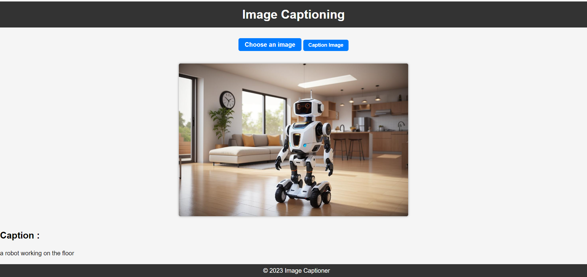
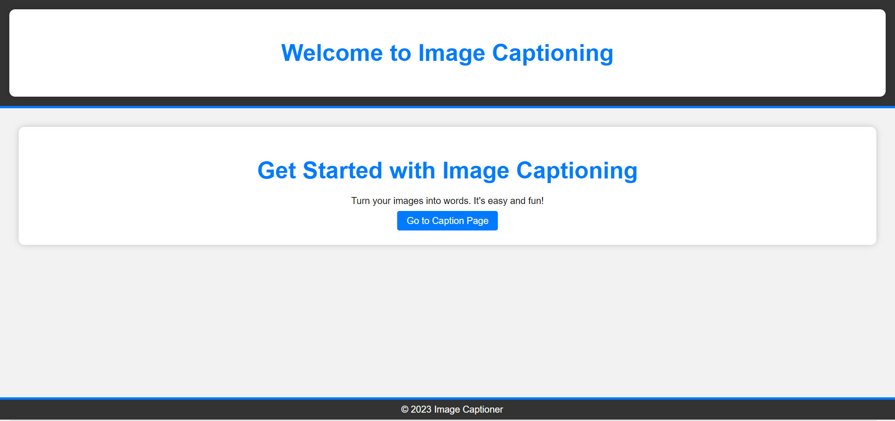

# Image Captioning with LSTM and CNN

This project focuses on generating captions for images using a combination of LSTM (Long Short-Term Memory) and CNN (Convolutional Neural Network) models trained on the Flickr 8K dataset. The aim is to provide descriptive and accurate captions for images automatically.

## Features

- **Dataset**: Utilizes the Flickr 8K dataset containing images and corresponding captions for training the models.
- **Models Used**:
  - **CNN**: Extracts image features.
  - **LSTM**: Generates textual descriptions.
- **Flask Integration**: Offers a user-friendly interface to upload images and obtain generated captions.
- **BLIP Model Integration**: Leverages the power of the BLIP open-source model for improved caption predictions.

## File Structure

The project files are organized as follows:

- `main.py`: Flask application allowing image upload and caption generation.
- `models/`: Directory containing LSTM and CNN model files.
- `BLIP/`: Integration of BLIP model for enhanced predictions.
- `Flickr_8k/`: Folder housing the Flickr 8K dataset used for training.
- `static and template `:Folder containing the html and css file for flask
- `test_model.py` :utility file to generate the caption and send it to flask file

## Getting Started

To run the application locally:

1. Clone the repository:

    ```bash
    ([https://github.com/harish-123445/CaptionCraft.git](https://github.com/kaifshaheemj/CAPGEN.git))
    ```


2. Start the Flask application:

    ```bash
    python main.py
    ```

4. Open your browser and visit `http://localhost:5000` to access the image captioning interface.

## Project Files

For the complete set of project files, including trained models and dataset:

[Google Drive Link - Image Captioning Project Files](https://drive.google.com/drive/folders/1uBk-Qqi--yepbk6zHqHIwyzBaFyrR-d-?usp=sharing)

I hereby include the output images 


## Acknowledgments

- This project incorporates the BLIP open-source model for improved image caption predictions.
- The LSTM and CNN models are trained using the Flickr 8K dataset, acknowledging its contribution to this work.

Feel free to explore and contribute to this project!


